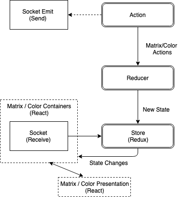

# Matrix Client

The matrix client is a React front end that renders a matrix of pixels (represented as buttons) and a control panel consisting of a color control and a reset control. The rendered color control is an HTML5 input color component. Matrix pixel colors can be changed by selecting a color, followed by clicking on a matrix pixel.

## Technologies

-   React/Redux
-   Socket.io
-   Sass (Styling)

| React Component / Socket.io Interaction |
| :-------------------------------------: |
|                   |
