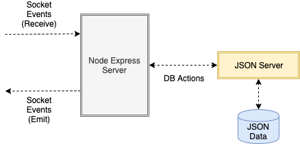

# Matrix Server

The matrix server is a Node.js Express server that utilizes Socket.IO for receiving events from the client and emitting events back to the client. The server communicates with a JSON Server for storing the data as JSON.

## Technologies

-   Node.js (Express)
-   Socket.io
-   Axios
-   JSON Server
-   JSON

| Node (Express) / Socket.io / JSON DB Interaction |
| :----------------------------------------------: |
|                            |
